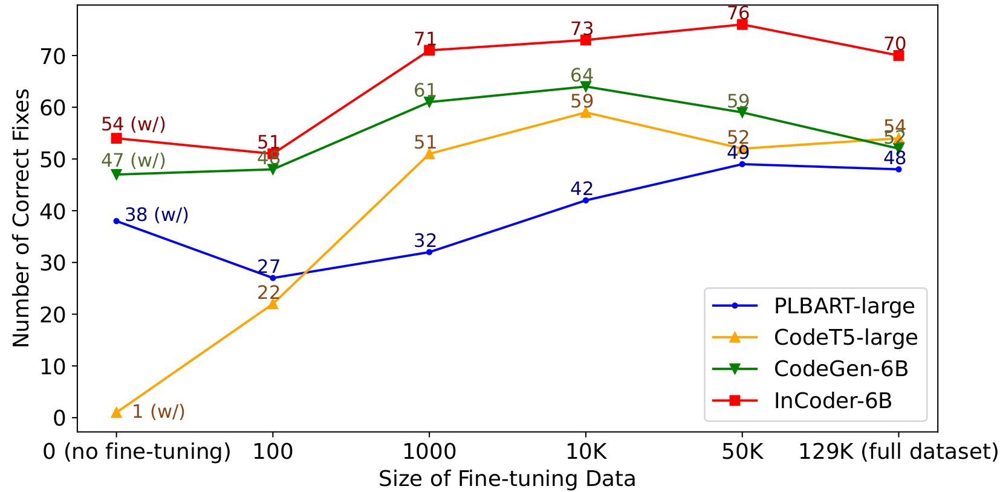

# Impact of Code Language Models on Automated Program Repair
This is the artifact of paper "Impact of Code Language Models on Automated Program Repair, Nan Jiang, Kevin Liu, Thibaud Lutellier, and Lin Tan", [ICSE 2023](https://conf.researchr.org/track/icse-2023/icse-2023-technical-track).

## Dependency
* Python 3.10.4
* PyTorch 1.12.0
* Huggingface transformers 4.21.0
* Java 8
* Docker
* nvidia-docker
* Defects4J

## To Run in Docker
* To run this artifact in docker, you need to have [docker](https://docs.docker.com/desktop/install/linux-install/) installed on the host system first.
* To use GPUs in docker, you need to install [nvidia-docker](https://docs.nvidia.com/datacenter/cloud-native/container-toolkit/install-guide.html) on the host system.
* Pull the docker image, which contains a copy of the whole artifact as well as all the dependencies satisfied: 
```
docker pull jiang719/clm-apr:latest
```
* Start the docker image:
```
docker run -it --name clm --gpus all jiang719/clm-apr:latest
cd /home/CLM
bash setup.sh
```

## Content
The file structure of the artifact is as follow:
* **clm-apr:**
    * **plbart:** source code to generate patches with PLBART models.
    * **codet5:** source code to generate patches with CodeT5 models.
    * **codegen:** source code to generate patches with CodeGen models.
    * **incoder:** source code to generate patches with InCoder models.
    * **plbart_finetune:** source code to finetune PLBART models and generate patches with the finetuned models.
    * **codet5_finetune:** source code to finetune CodeT5 models and generate patches with the finetuned models.
    * **codegen_finetune:** source code to finetune CodeGen models and generate patches with the finetuned models.
    * **incoder_finetune:** source code to finetune InCoder models and generate patches with the finetuned models.
    * **defects4j:** patches generated for Defects4J benchmark, by different code language models.
    * **quixbugs:** patches generated for QuixBugs benchmark, by different code language models.
    * **humaneval:** patches generated for HumanEval-Java benchmark, by different code language models.
* **humaneval-java:** The HumanEval-Java benchmark created by this work.
* **jasper:** A Java tool to parse Java files and prepare input for different code language models.
* **models:** The folder to put downloaded and fine-tuned language models.
* **tmp_benchmarks:** The folder to put temprary folders for patches validation.
* **preprint_for_artifact_evaluation.pdf:** An early draft of the preprint for artifact evaluation purpose only (to be updated).

## Reproduction
This section introduces how to partially reproduce the result shown in the paper.

* **Takeaway:**
    * **RQ1:** ```clm-apr/[benchmark]/[model]_result``` contains the generated and validated patches by ```[model]``` for ```[benchmark]```. E.g., ```clm-apr/humaneval/plbart_result``` contains the patches generated by PLBART models and for HumanEval-Java benchmark. Each file in the result folder is named as ```[model]_[size]_output_[config].json```, where the ```[model]_[size]``` denotes which model is used, and each model has two configurations (one without feeding buggy lines, and the other with feeding buggy lines). E.g., ```plbart_small_output_c1.json``` is the patches generated by PLBART-small model without feeding buggy lines.
    * **RQ2:** ```clm-apr/[benchmark]/[model]_fientune_result``` contains the generated and validated patches by finetuned ```[model]``` for ```[benchmark]```.
* **Reproduce:**
    * **To download CLMs:**
    These code language models are very large (tens of GBs in total), it's recommend to only download the ones you need.
    ```
    cd models

    # download plbart-base/large
    git clone https://huggingface.co/uclanlp/plbart-base plbart-base
    git clone https://huggingface.co/uclanlp/plbart-large plbart-large

    # download codet5-small/base/large
    git clone https://huggingface.co/Salesforce/codet5-small codet5-small
    git clone https://huggingface.co/Salesforce/codet5-base codet5-base
    git clone https://huggingface.co/Salesforce/codet5-large codet5-large

    # download codegen-350M/2B/6B-multi
    git clone https://huggingface.co/Salesforce/codegen-350M-multi codegen-350M
    git clone https://huggingface.co/Salesforce/codegen-2B-multi codegen-2B
    git clone https://huggingface.co/Salesforce/codegen-6B-multi codegen-6B

    # download incoder-1B/6B
    git clone https://huggingface.co/facebook/incoder-1B incoder-1B
    git clone https://huggingface.co/facebook/incoder-6B incoder-6B
    ```
    The finetuned CLMs are avaiable here: [https://doi.org/10.5281/zenodo.7559244](https://doi.org/10.5281/zenodo.7559244), [https://doi.org/10.5281/zenodo.7559277](https://doi.org/10.5281/zenodo.7559277)
    * **To re-generate patches with CLMs:**
    ```
    cd clm-apr/plbart
    python defects4j_plbart.py ../../models/    # generate patches for Defects4J benchmark.
    python quixbugs_plbart.py ../../models/     # generate patches for QuixBugs benchmark.
    python humaneval_plbart.py ../../models/    # generate patches for HumanEval-Java benchmark.
    ```
    * **To re-generate patches with finetuned CLMs:**
    ```
    cd clm-apr/plbart-finetune
    python defects4j_plbart_finetune.py ../../models/
    python quixbugs_plbart_finetune.py ../../models/
    python humaneval_plbart_finetune.py ../../models/
    ```


## Development
* **To re-finetune CLMs:**
```
# take PLBART models as an example, to finetune a new PLBART model for APR
cd clm-apr/plbart_finetune
python finetune.py
```
You may want to modify several paths in the ```finetune.py```, ```training_file``` is the path to the training data, ```validation_file``` is the path to the validation data (dataset avaiable here: [https://doi.org/10.5281/zenodo.7559208](https://doi.org/10.5281/zenodo.7559208)), ```vocabulary_file, pretrained_file``` point to the directory of CLMs you want to finetune, and ```save_dir``` points to the directory where you want to store the finetuned model.

## Impact of fine-tuning data size


## Size, time, and memory efficiency of CLMs


## Citation
If you find this code to be useful for your research, please consider citing:
```
@inproceedings{jiang@impact,
   author = {Jiang, Nan and Liu, Kevin and Lutellier, Thibaud and Tan, Lin},
   title = {Impact of Code Language Models on Automated Program Repair},
   year = {2023},
   isbn = {9781665457019},
   publisher = {IEEE Press},
   url = {https://doi.org/10.1109/ICSE48619.2023.00125},
   doi = {10.1109/ICSE48619.2023.00125},
   booktitle = {Proceedings of the 45th International Conference on Software Engineering},
   pages = {1430–1442},
   numpages = {13},
   keywords = {code language model, automated program repair, deep learning, fine-tuning},
   location = {Melbourne, Victoria, Australia},
   series = {ICSE '23}
}
```
